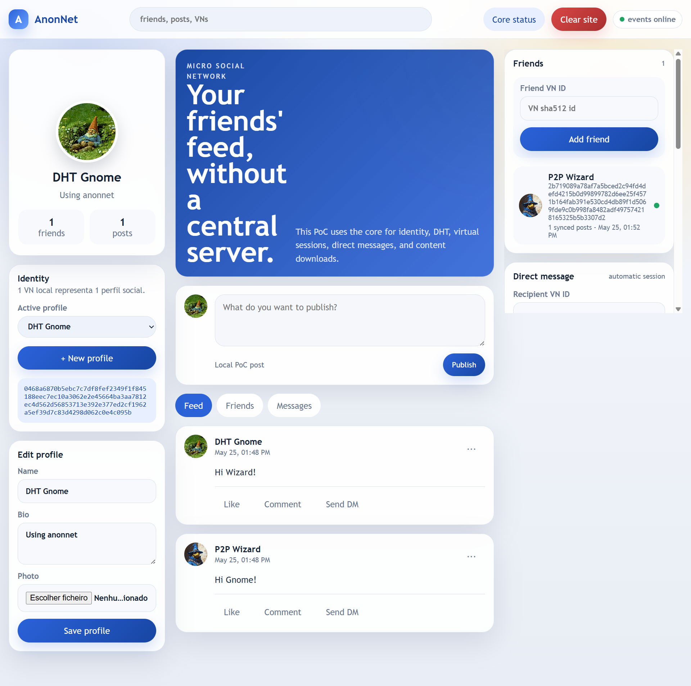

# AnonNetCore Python MVP

AnonNetCore is a functional decentralized-network MVP written in Python. It
validates a layered architecture where physical nodes form the transport and DHT
network, while virtual nodes own application identities, build routes, establish
end-to-end sessions, exchange messages, and publish content.

The repository is intentionally practical: it includes the core, a Docker
cluster runner, a local HTTP/WebSocket API, a debug console, integration smokes,
and a browser-only social PoC that opens directly from `poc/index.html`.

## Social PoC Preview

The MVP includes a local social-network proof of concept backed by real core
flows: virtual nodes as profiles, DHT-published profile state, friend feeds, and
direct messages over virtual sessions.




## What It Proves

- A physical P2P layer with bootstrap, peer exchange, validation, sessions,
  keepalive, reliable payload delivery, TCP, UDP, and relay transport.
- Generic distributed tables for peer discovery, route discovery, content
  holders, mutable pointers, and future structured data.
- Route construction separated from route execution, with a strategy-based
  builder and a small hop-by-hop executor.
- Virtual identities that can publish reachable routes, establish virtual
  sessions, exchange direct messages, and download content by byte ranges.
- A local API that lets external apps use the core without importing Python
  internals.
- A social-network PoC using only local HTML/JS plus the local core API.

## Architecture At A Glance

```text
External App / PoC
  -> Local HTTP API + WebSocket events
  -> Virtual Layer: virtual nodes, sessions, messages, content
  -> Route Layer: DRT routes, random-walk TTL builder, ROUTE_DATA executor
  -> Physical Layer: physical sessions, TCP, UDP, relay, peer validation
  -> Distributed Tables: DPNT, DRT, DDT, DPT, DTT
```

The physical layer moves packets. The route layer decides how a virtual packet
crosses physical nodes. The virtual layer owns application identity and
end-to-end semantics.

## Core Features

- **Physical nodes**: long-lived physical identities, listener endpoints,
  validation, DPNT publication, and peer exchange.
- **Transport adapters**: TCP, UDP with simple fragmentation/reassembly, and
  `relay_tcp` for private nodes behind public relay-capable peers.
- **Secure sessions**: KEM-based session establishment, signatures,
  AES-256-GCM-SIV encrypted payloads, AAD binding, keepalive, ordered reliable
  payload delivery, retry, and ACK handling.
- **DHT**: deterministic `sha512(namespace|logical_key)` keys, XOR
  responsibility, replicated publication, hop-by-hop query forwarding, semantic
  proof-of-work nonces, and maintenance.
- **Routes**: `random_walk_ttl` route creation, final-PN validation, DRT
  publication, `ROUTE_CREATE_OK`, `ROUTE_CREATE_FAIL`, and strategy-agnostic
  `ROUTE_DATA` execution.
- **Virtual layer**: local/remote virtual nodes, DRT route discovery, virtual
  sessions, direct messages, and virtual content transfers.
- **API and events**: local HTTP API on `127.0.0.1:18080` and WebSocket events
  on `127.0.0.1:18081/v1/events`.
- **Observability**: async file logs, optional console logs, centralized smoke
  warning/error collection, and a Debug Console.
- **PoC**: a local social app with profiles, friends, feed posts, profile
  publication through DDT/DPT, and direct messages through virtual sessions.

## Quick Start

Requirements:

- Python 3.12+
- Docker Desktop for cluster and smoke tests
- A local virtual environment with the project dependencies installed

Create or reuse the local virtual environment:

```powershell
py -m venv .venv
.\.venv\Scripts\python.exe -m pip install -r requirements.txt
```

Run the social PoC with a 10-node Docker cluster:

```powershell
.\.venv\Scripts\python.exe scripts\run_poc.py 10
```

The command starts the Docker cluster, starts one local core, starts the Debug
Console, and opens the local HTML PoC. To keep the browser closed:

```powershell
.\.venv\Scripts\python.exe scripts\run_poc.py 10 --no-open
```

Run only one local core:

```powershell
.\.venv\Scripts\python.exe scripts\run_core.py
```

Run the official integration smokes:

```powershell
.\.venv\Scripts\python.exe scripts\run_smokes.py 10
```

The smoke runner prints each validation step, captures logs under
`data/local/smoke-runs`, summarizes the randomized cluster topology, and stops
the cluster at the end.

## Repository Map

```text
app/              Core engine, protocols, DHT, routes, sessions, API, transports
cluster/          Docker cluster generation and lifecycle helpers
documentation/    Technical Markdown documentation
poc/              Browser-only social-network PoC
scripts/          Developer entry points for core, PoC, and smokes
tests/            Integration smokes and shared test helpers
thesis/           Thesis source and generated PDF assets
```

## Documentation

- [Technical overview](documentation/documentation.md)
- [Entities and persistence](documentation/entities.md)
- [DHT and distributed tables](documentation/dht_doc.md)
- [Routes and route execute](documentation/route.md)
- [Local API](documentation/api.md)
- [Social PoC](documentation/poc.md)
- [Faults and limits](documentation/faults.md)
- [Tests](documentation/tests/README.md)
- [Thesis source](thesis/main.tex)

## Current Status

This is a working MVP and thesis prototype, not production-ready infrastructure.
It demonstrates the core architecture, local API, integration tests, relay/UDP
transport experiments, and a social application PoC. Production use would still
require security audits, stronger abuse controls, mature NAT traversal, resource
governance, long-running Internet-scale validation, and operational hardening.

Repository: <https://github.com/andersonsimioni/AnonNetCore_py>
